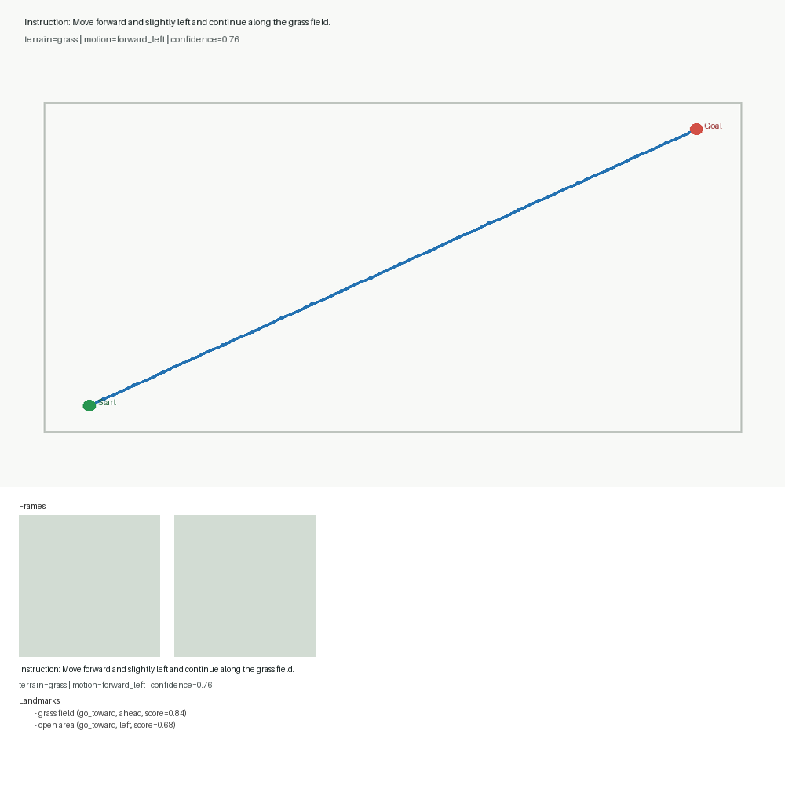
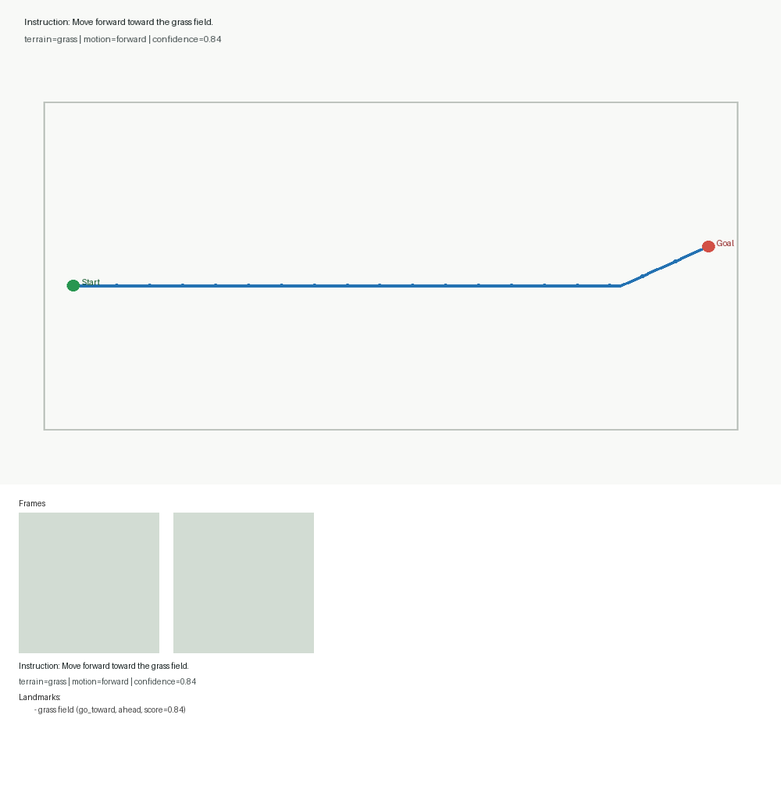
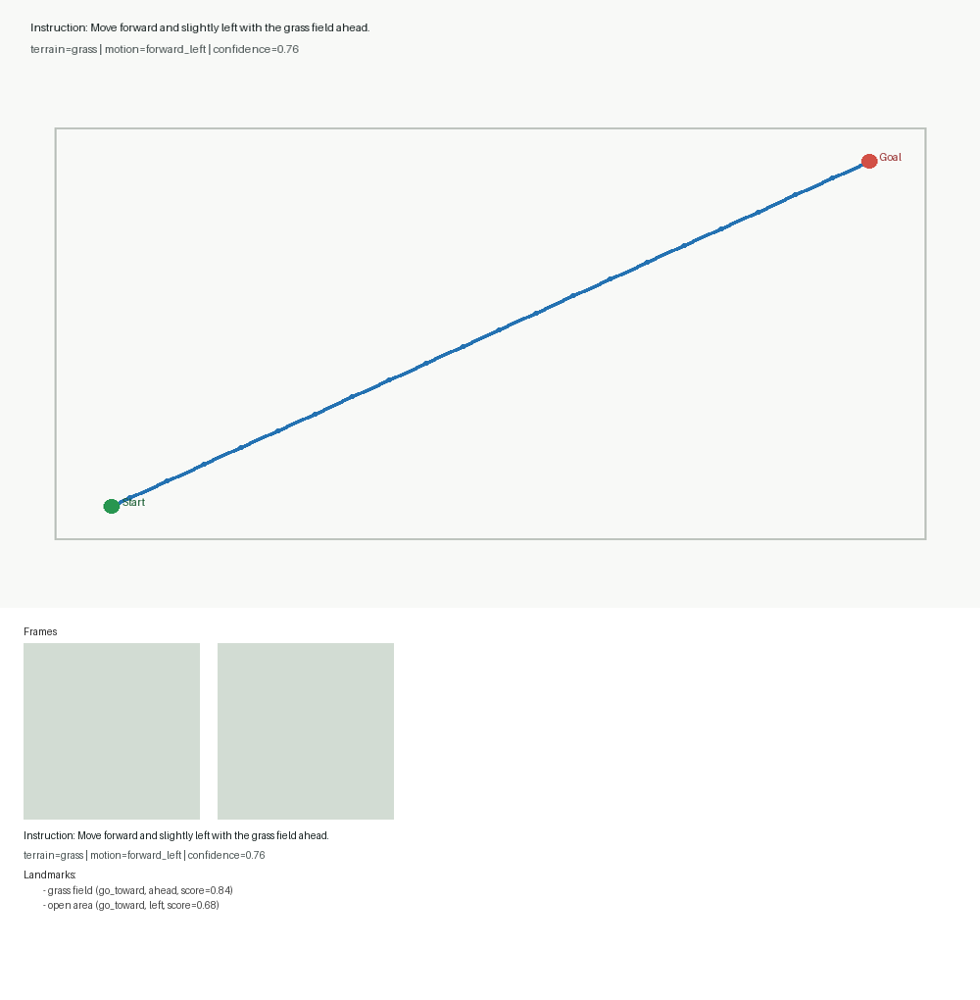

# Outdoor-VLN Pilot Sample Visualizations

## Sample 8

- instruction: Continue along the grass field.
- terrain: grass
- motion: forward
- confidence: 0.84
- landmarks: grass field (go_toward, ahead)

## Sample 13

- instruction: Move forward and slightly left and continue along the grass field.
- terrain: grass
- motion: forward_left
- confidence: 0.76
- landmarks: grass field (go_toward, ahead), open area (go_toward, left)

## Sample 7

- instruction: Keep following the grass field ahead.
- terrain: grass
- motion: forward
- confidence: 0.84
- landmarks: grass field (go_toward, ahead)

## Sample 6

- instruction: Move forward toward the grass field.
- terrain: grass
- motion: forward
- confidence: 0.84
- landmarks: grass field (go_toward, ahead)

## Sample 14

- instruction: Move forward and slightly left with the grass field ahead.
- terrain: grass
- motion: forward_left
- confidence: 0.76
- landmarks: grass field (go_toward, ahead), open area (go_toward, left)
