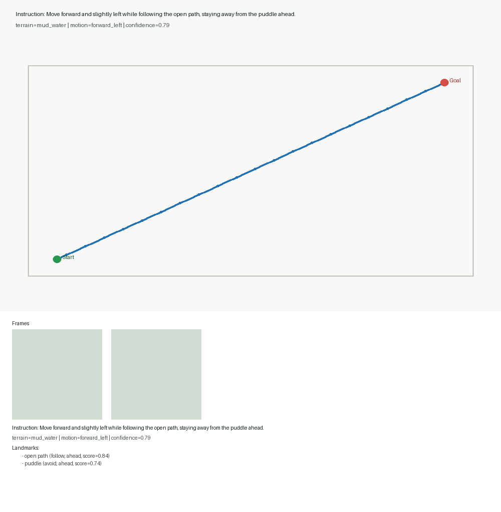
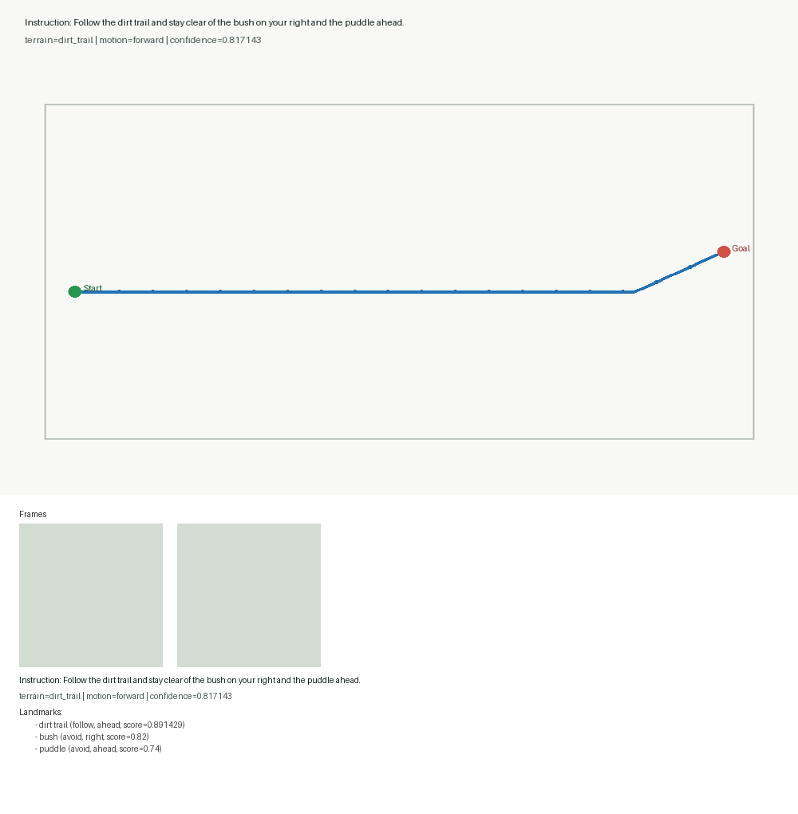

# Outdoor-VLN Pilot Sample Visualizations

## Sample 15

- instruction: Move forward and slightly left while following the open path, staying away from the puddle ahead.
- terrain: mud_water
- motion: forward_left
- confidence: 0.79
- landmarks: open path (follow, ahead), puddle (avoid, ahead)

## Sample 5

- instruction: Follow the dirt trail and stay clear of the bush on your right and the puddle ahead.
- terrain: dirt_trail
- motion: forward
- confidence: 0.817143
- landmarks: dirt trail (follow, ahead), bush (avoid, right), puddle (avoid, ahead)
