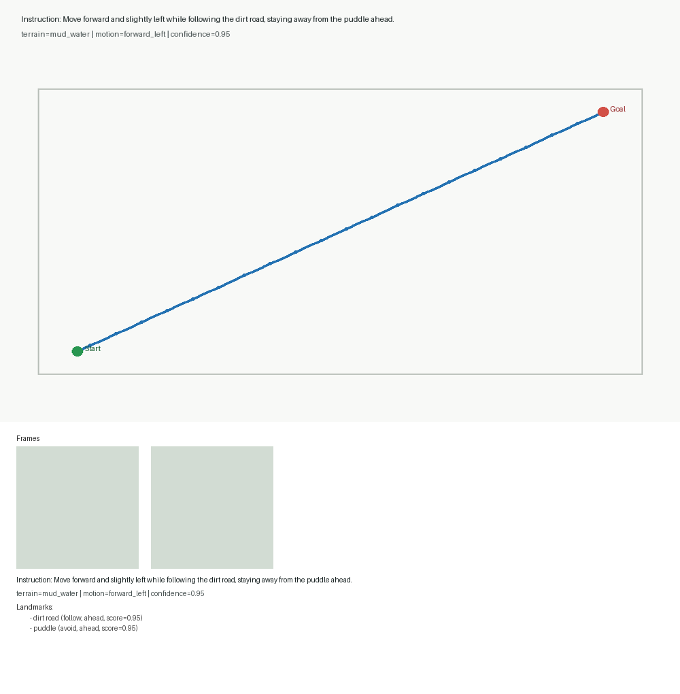
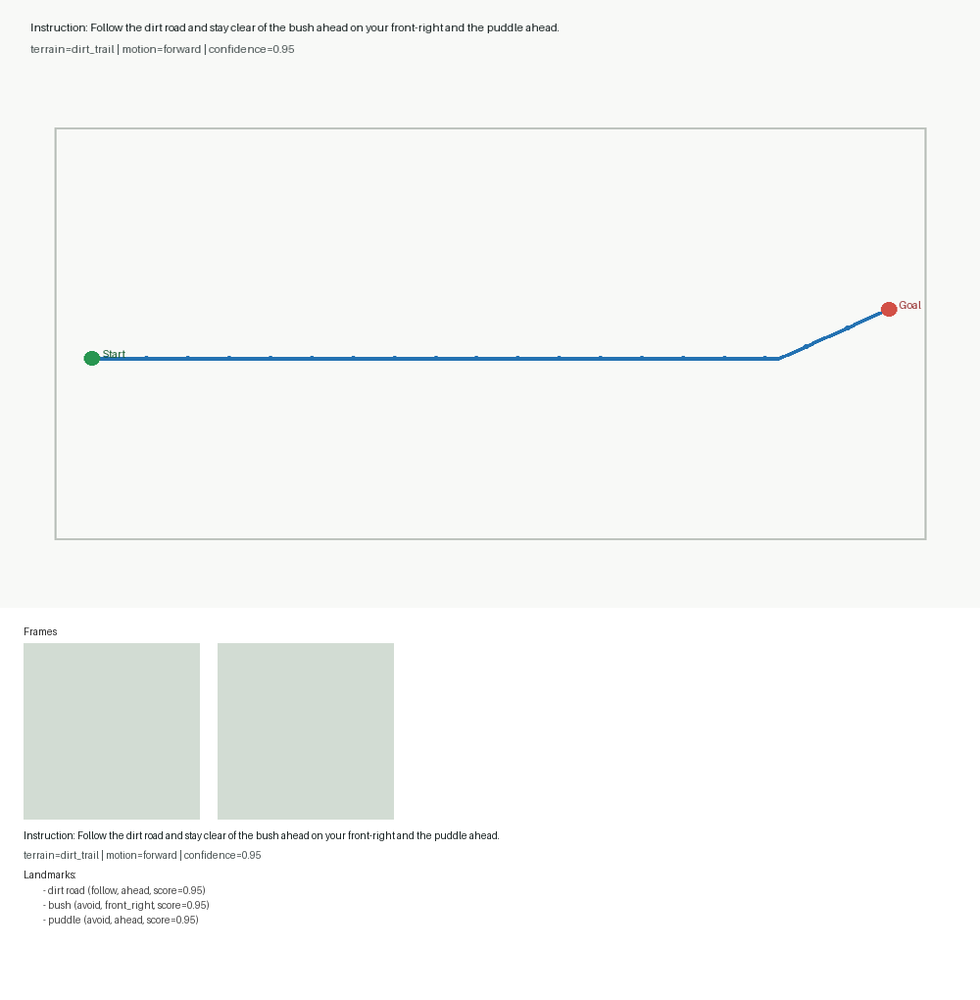

# Outdoor-VLN Pilot Sample Visualizations

## Sample 15

- instruction: Move forward and slightly left while following the dirt road, staying away from the puddle ahead.
- terrain: mud_water
- motion: forward_left
- confidence: 0.95
- landmarks: dirt road (follow, ahead), puddle (avoid, ahead)

## Sample 5

- instruction: Follow the dirt road and stay clear of the bush ahead on your front-right and the puddle ahead.
- terrain: dirt_trail
- motion: forward
- confidence: 0.95
- landmarks: dirt road (follow, ahead), bush (avoid, front_right), puddle (avoid, ahead)
