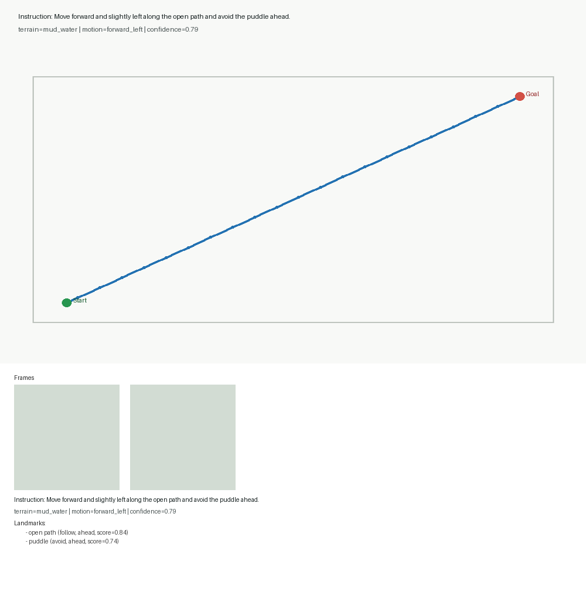
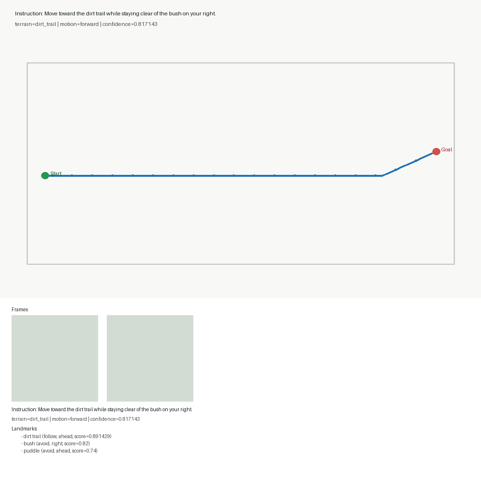
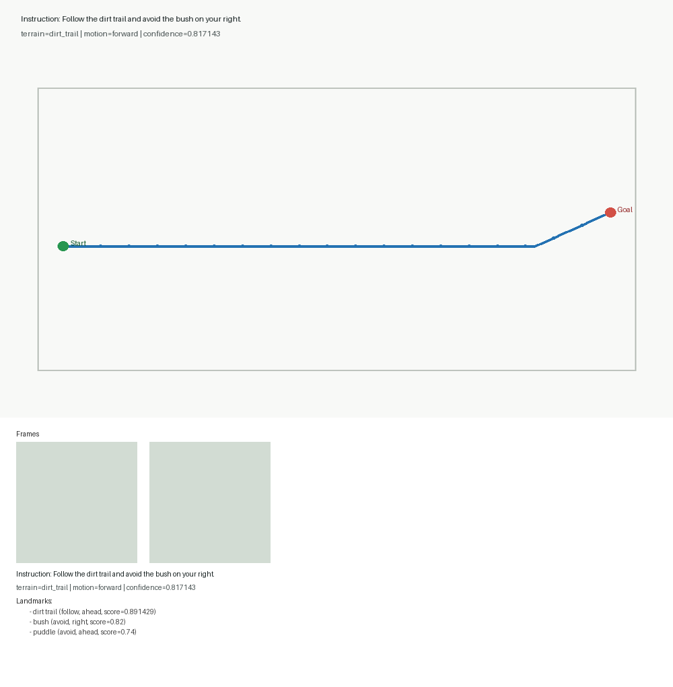

# Outdoor-VLN Sample Visualizations

## Sample 3

- instruction: Move forward and slightly left along the open path and avoid the puddle ahead.
- terrain: mud_water
- motion: forward_left
- confidence: 0.79
- landmarks: open path (follow, ahead), puddle (avoid, ahead)

## Sample 1

- instruction: Move toward the dirt trail while staying clear of the bush on your right.
- terrain: dirt_trail
- motion: forward
- confidence: 0.817143
- landmarks: dirt trail (follow, ahead), bush (avoid, right), puddle (avoid, ahead)

## Sample 2

- instruction: Continue along the dirt trail, keeping away from the bush on your right.
- terrain: dirt_trail
- motion: forward
- confidence: 0.817143
- landmarks: dirt trail (follow, ahead), bush (avoid, right), puddle (avoid, ahead)

## Sample 4

- instruction: Move forward and slightly left toward the open path while staying clear of the puddle ahead.
- terrain: mud_water
- motion: forward_left
- confidence: 0.79
- landmarks: open path (follow, ahead), puddle (avoid, ahead)

## Sample 0

- instruction: Follow the dirt trail and avoid the bush on your right.
- terrain: dirt_trail
- motion: forward
- confidence: 0.817143
- landmarks: dirt trail (follow, ahead), bush (avoid, right), puddle (avoid, ahead)
