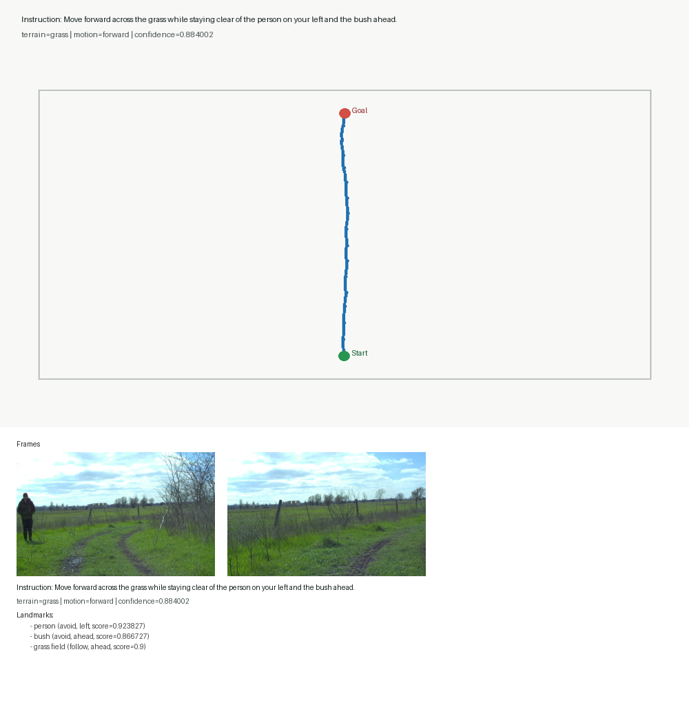
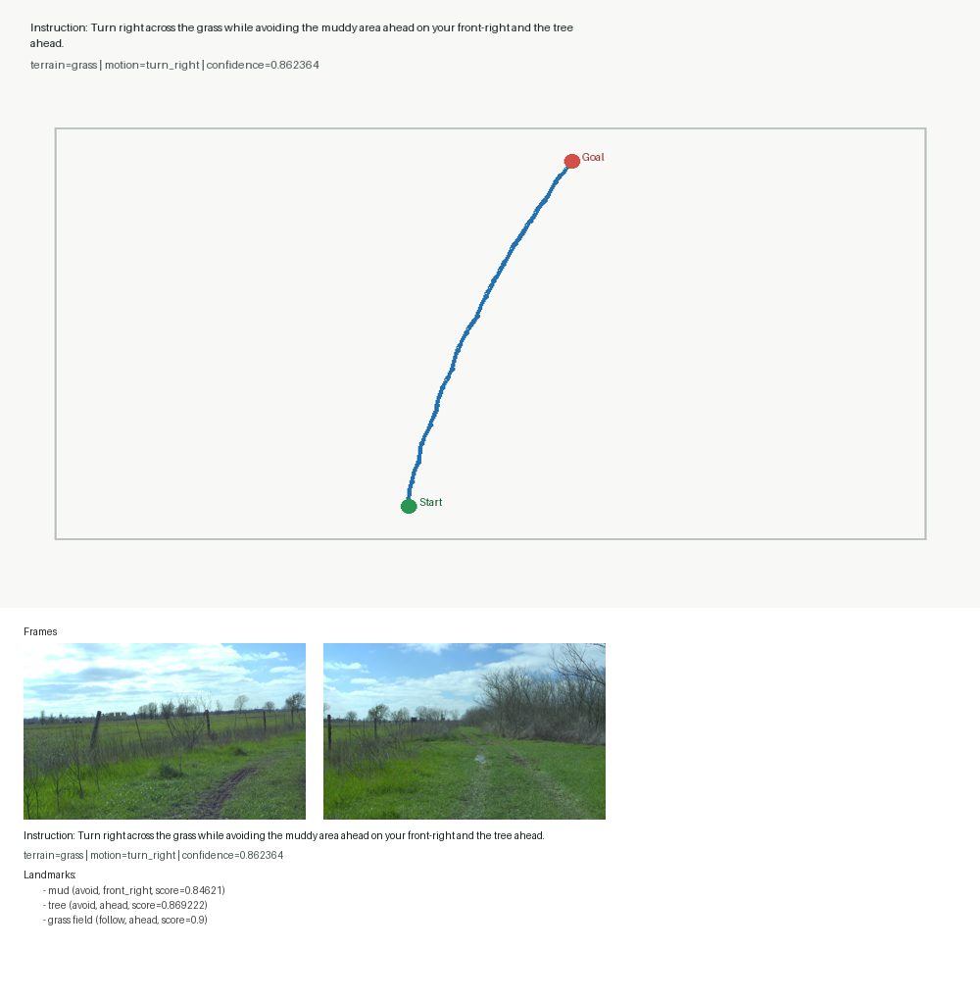
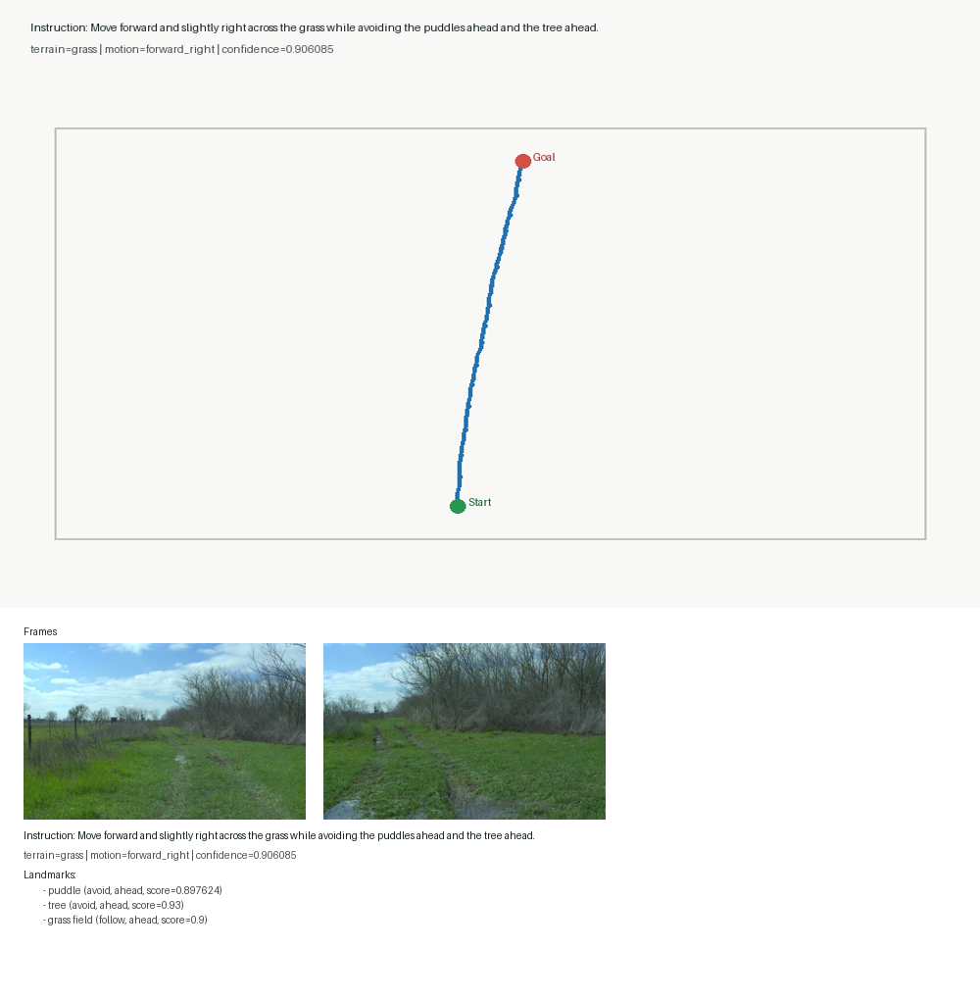
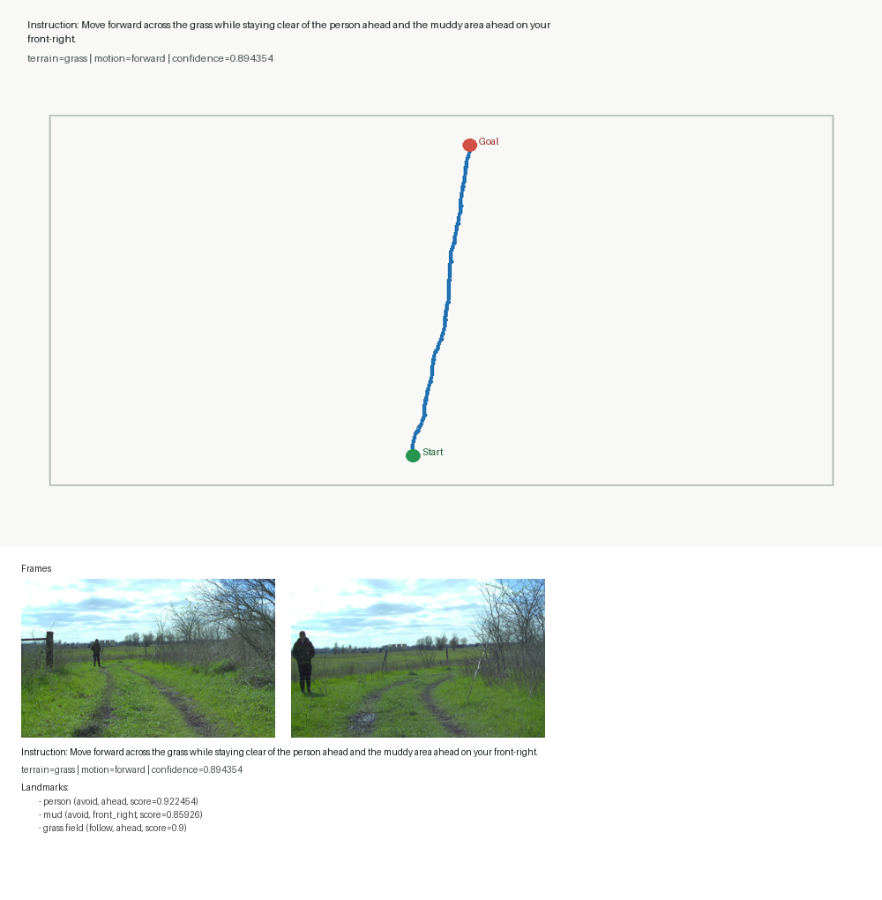
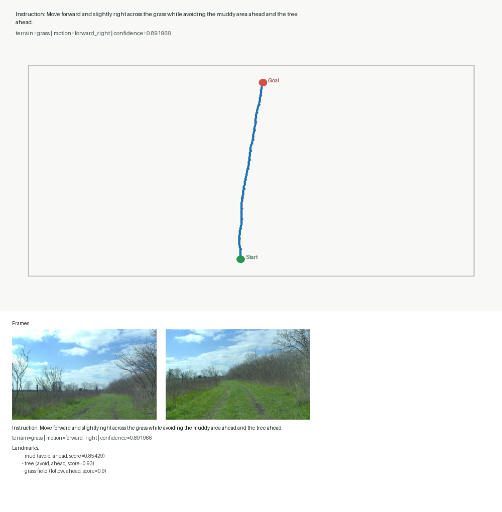
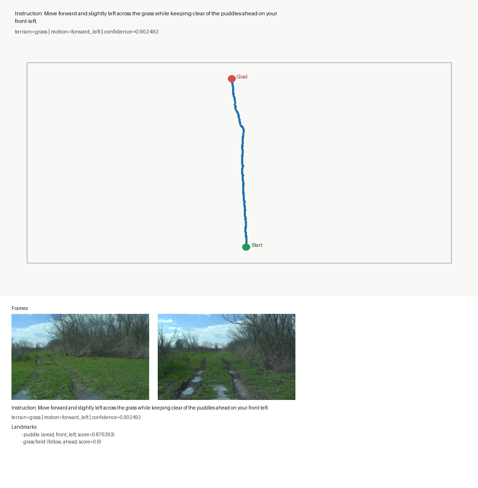
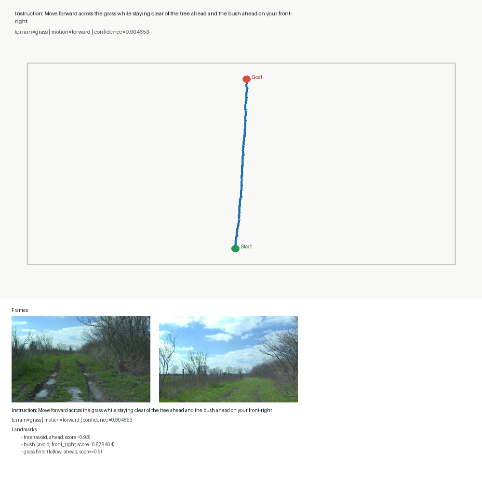
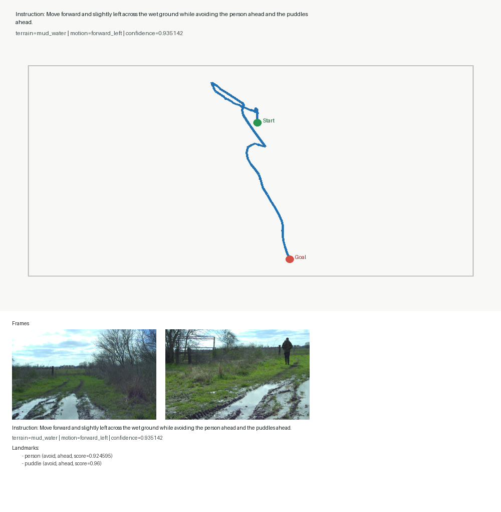

# Outdoor-VLN Manual Audit Sample Visualizations

## Audit Row 1 / JSONL Index 9

- instruction: Move forward across the grass while staying clear of the person on your left and the bush ahead.
- terrain: grass
- motion: forward
- confidence: 0.884002
- landmarks: person (avoid, left), bush (avoid, ahead), grass field (follow, ahead)

## Audit Row 2 / JSONL Index 12

- instruction: Move forward across the grass while staying clear of the person on your left and the bush ahead.
- terrain: grass
- motion: forward
- confidence: 0.884002
- landmarks: person (avoid, left), bush (avoid, ahead), grass field (follow, ahead)

## Audit Row 3 / JSONL Index 5

- instruction: Move forward across the grass while staying clear of the person on your left and the bush ahead.
- terrain: grass
- motion: forward
- confidence: 0.884002
- landmarks: person (avoid, left), bush (avoid, ahead), grass field (follow, ahead)

## Audit Row 4 / JSONL Index 20

- instruction: Move forward and slightly left across the grass while staying clear of the puddles ahead on your front-left.
- terrain: grass
- motion: forward_left
- confidence: 0.902492
- landmarks: puddle (avoid, front_left), grass field (follow, ahead)

## Audit Row 5 / JSONL Index 31

- instruction: Move forward and slightly right across the grass while staying clear of the muddy area ahead and the tree ahead.
- terrain: grass
- motion: forward_right
- confidence: 0.891966
- landmarks: mud (avoid, ahead), tree (avoid, ahead), grass field (follow, ahead)

## Audit Row 6 / JSONL Index 22

- instruction: Move forward and slightly left across the grass while avoiding the puddles ahead on your front-left.
- terrain: grass
- motion: forward_left
- confidence: 0.902492
- landmarks: puddle (avoid, front_left), grass field (follow, ahead)

## Audit Row 7 / JSONL Index 29

- instruction: Move forward and slightly right across the grass while staying clear of the muddy area ahead and the tree ahead.
- terrain: grass
- motion: forward_right
- confidence: 0.891966
- landmarks: mud (avoid, ahead), tree (avoid, ahead), grass field (follow, ahead)

## Audit Row 8 / JSONL Index 16

- instruction: Turn right across the grass while avoiding the muddy area ahead on your front-right and the tree ahead.
- terrain: grass
- motion: turn_right
- confidence: 0.862364
- landmarks: mud (avoid, front_right), tree (avoid, ahead), grass field (follow, ahead)

## Audit Row 9 / JSONL Index 26

- instruction: Move forward and slightly right across the grass while staying clear of the muddy area ahead and the tree ahead.
- terrain: grass
- motion: forward_right
- confidence: 0.891966
- landmarks: mud (avoid, ahead), tree (avoid, ahead), grass field (follow, ahead)

## Audit Row 10 / JSONL Index 24

- instruction: Move forward across the grass while keeping clear of the tree ahead and the bush ahead on your front-right.
- terrain: grass
- motion: forward
- confidence: 0.904653
- landmarks: tree (avoid, ahead), bush (avoid, front_right), grass field (follow, ahead)

## Audit Row 11 / JSONL Index 14

- instruction: Turn right across the grass while staying clear of the muddy area ahead on your front-right and the tree ahead.
- terrain: grass
- motion: turn_right
- confidence: 0.862364
- landmarks: mud (avoid, front_right), tree (avoid, ahead), grass field (follow, ahead)

## Audit Row 12 / JSONL Index 10

- instruction: Move forward across the grass while staying clear of the person on your left and the bush ahead.
- terrain: grass
- motion: forward
- confidence: 0.884002
- landmarks: person (avoid, left), bush (avoid, ahead), grass field (follow, ahead)

## Audit Row 13 / JSONL Index 11

- instruction: Move forward across the grass while staying clear of the person on your left and the bush ahead.
- terrain: grass
- motion: forward
- confidence: 0.884002
- landmarks: person (avoid, left), bush (avoid, ahead), grass field (follow, ahead)

## Audit Row 14 / JSONL Index 27

- instruction: Move forward and slightly right across the grass while keeping clear of the muddy area ahead and the tree ahead.
- terrain: grass
- motion: forward_right
- confidence: 0.891966
- landmarks: mud (avoid, ahead), tree (avoid, ahead), grass field (follow, ahead)

## Audit Row 15 / JSONL Index 8

- instruction: Move forward across the grass while staying clear of the person on your left and the bush ahead.
- terrain: grass
- motion: forward
- confidence: 0.884002
- landmarks: person (avoid, left), bush (avoid, ahead), grass field (follow, ahead)

## Audit Row 16 / JSONL Index 19

- instruction: Move forward and slightly right across the grass while avoiding the puddles ahead and the tree ahead.
- terrain: grass
- motion: forward_right
- confidence: 0.906085
- landmarks: puddle (avoid, ahead), tree (avoid, ahead), grass field (follow, ahead)

## Audit Row 17 / JSONL Index 30

- instruction: Move forward and slightly right across the grass while staying clear of the muddy area ahead and the tree ahead.
- terrain: grass
- motion: forward_right
- confidence: 0.891966
- landmarks: mud (avoid, ahead), tree (avoid, ahead), grass field (follow, ahead)

## Audit Row 18 / JSONL Index 6

- instruction: Move forward across the grass while keeping clear of the person on your left and the bush ahead.
- terrain: grass
- motion: forward
- confidence: 0.884002
- landmarks: person (avoid, left), bush (avoid, ahead), grass field (follow, ahead)

## Audit Row 19 / JSONL Index 25

- instruction: Move forward across the grass while avoiding the tree ahead and the bush ahead on your front-right.
- terrain: grass
- motion: forward
- confidence: 0.904653
- landmarks: tree (avoid, ahead), bush (avoid, front_right), grass field (follow, ahead)

## Audit Row 20 / JSONL Index 0

- instruction: Move forward and slightly left across the wet ground while keeping clear of the person ahead and the puddles ahead.
- terrain: mud_water
- motion: forward_left
- confidence: 0.935142
- landmarks: person (avoid, ahead), puddle (avoid, ahead)

## Audit Row 21 / JSONL Index 33

- instruction: Move forward and slightly right across the grass while staying clear of the muddy area ahead and the tree ahead.
- terrain: grass
- motion: forward_right
- confidence: 0.891966
- landmarks: mud (avoid, ahead), tree (avoid, ahead), grass field (follow, ahead)

## Audit Row 22 / JSONL Index 13

- instruction: Move forward across the grass while staying clear of the person on your left and the bush ahead.
- terrain: grass
- motion: forward
- confidence: 0.884002
- landmarks: person (avoid, left), bush (avoid, ahead), grass field (follow, ahead)

## Audit Row 23 / JSONL Index 18

- instruction: Move forward and slightly right across the grass while keeping clear of the puddles ahead and the tree ahead.
- terrain: grass
- motion: forward_right
- confidence: 0.906085
- landmarks: puddle (avoid, ahead), tree (avoid, ahead), grass field (follow, ahead)

## Audit Row 24 / JSONL Index 2

- instruction: Move forward across the grass while staying clear of the person ahead and the muddy area ahead on your front-right.
- terrain: grass
- motion: forward
- confidence: 0.894354
- landmarks: person (avoid, ahead), mud (avoid, front_right), grass field (follow, ahead)

## Audit Row 25 / JSONL Index 32

- instruction: Move forward and slightly right across the grass while staying clear of the muddy area ahead and the tree ahead.
- terrain: grass
- motion: forward_right
- confidence: 0.891966
- landmarks: mud (avoid, ahead), tree (avoid, ahead), grass field (follow, ahead)

## Audit Row 26 / JSONL Index 28

- instruction: Move forward and slightly right across the grass while avoiding the muddy area ahead and the tree ahead.
- terrain: grass
- motion: forward_right
- confidence: 0.891966
- landmarks: mud (avoid, ahead), tree (avoid, ahead), grass field (follow, ahead)

## Audit Row 27 / JSONL Index 21

- instruction: Move forward and slightly left across the grass while keeping clear of the puddles ahead on your front-left.
- terrain: grass
- motion: forward_left
- confidence: 0.902492
- landmarks: puddle (avoid, front_left), grass field (follow, ahead)

## Audit Row 28 / JSONL Index 3

- instruction: Move forward across the grass while keeping clear of the person ahead and the muddy area ahead on your front-right.
- terrain: grass
- motion: forward
- confidence: 0.894354
- landmarks: person (avoid, ahead), mud (avoid, front_right), grass field (follow, ahead)

## Audit Row 29 / JSONL Index 23

- instruction: Move forward across the grass while staying clear of the tree ahead and the bush ahead on your front-right.
- terrain: grass
- motion: forward
- confidence: 0.904653
- landmarks: tree (avoid, ahead), bush (avoid, front_right), grass field (follow, ahead)

## Audit Row 30 / JSONL Index 4

- instruction: Move forward across the grass while avoiding the person ahead and the muddy area ahead on your front-right.
- terrain: grass
- motion: forward
- confidence: 0.894354
- landmarks: person (avoid, ahead), mud (avoid, front_right), grass field (follow, ahead)

## Audit Row 31 / JSONL Index 34

- instruction: Move forward and slightly right across the grass while staying clear of the muddy area ahead and the tree ahead.
- terrain: grass
- motion: forward_right
- confidence: 0.891966
- landmarks: mud (avoid, ahead), tree (avoid, ahead), grass field (follow, ahead)

## Audit Row 32 / JSONL Index 15

- instruction: Turn right across the grass while keeping clear of the muddy area ahead on your front-right and the tree ahead.
- terrain: grass
- motion: turn_right
- confidence: 0.862364
- landmarks: mud (avoid, front_right), tree (avoid, ahead), grass field (follow, ahead)

## Audit Row 33 / JSONL Index 17

- instruction: Move forward and slightly right across the grass while staying clear of the puddles ahead and the tree ahead.
- terrain: grass
- motion: forward_right
- confidence: 0.906085
- landmarks: puddle (avoid, ahead), tree (avoid, ahead), grass field (follow, ahead)

## Audit Row 34 / JSONL Index 1

- instruction: Move forward and slightly left across the wet ground while avoiding the person ahead and the puddles ahead.
- terrain: mud_water
- motion: forward_left
- confidence: 0.935142
- landmarks: person (avoid, ahead), puddle (avoid, ahead)

## Audit Row 35 / JSONL Index 7

- instruction: Move forward across the grass while avoiding the person on your left and the bush ahead.
- terrain: grass
- motion: forward
- confidence: 0.884002
- landmarks: person (avoid, left), bush (avoid, ahead), grass field (follow, ahead)
