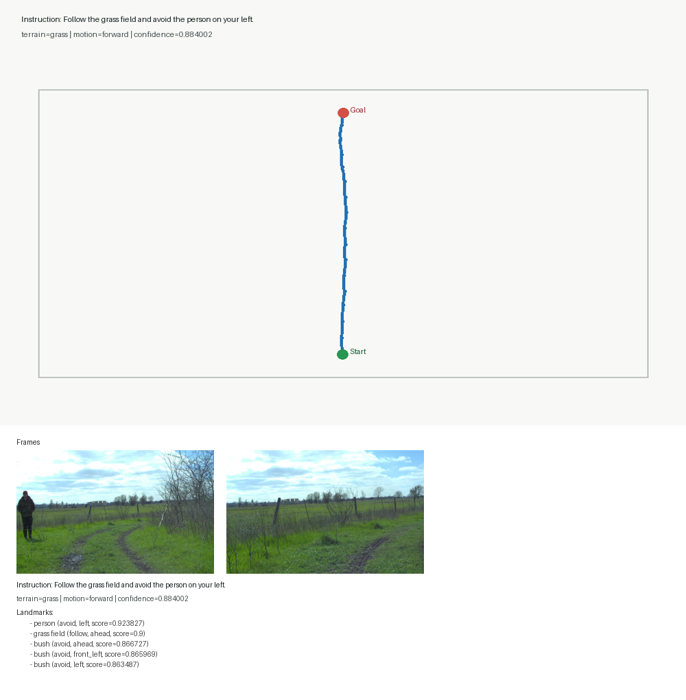
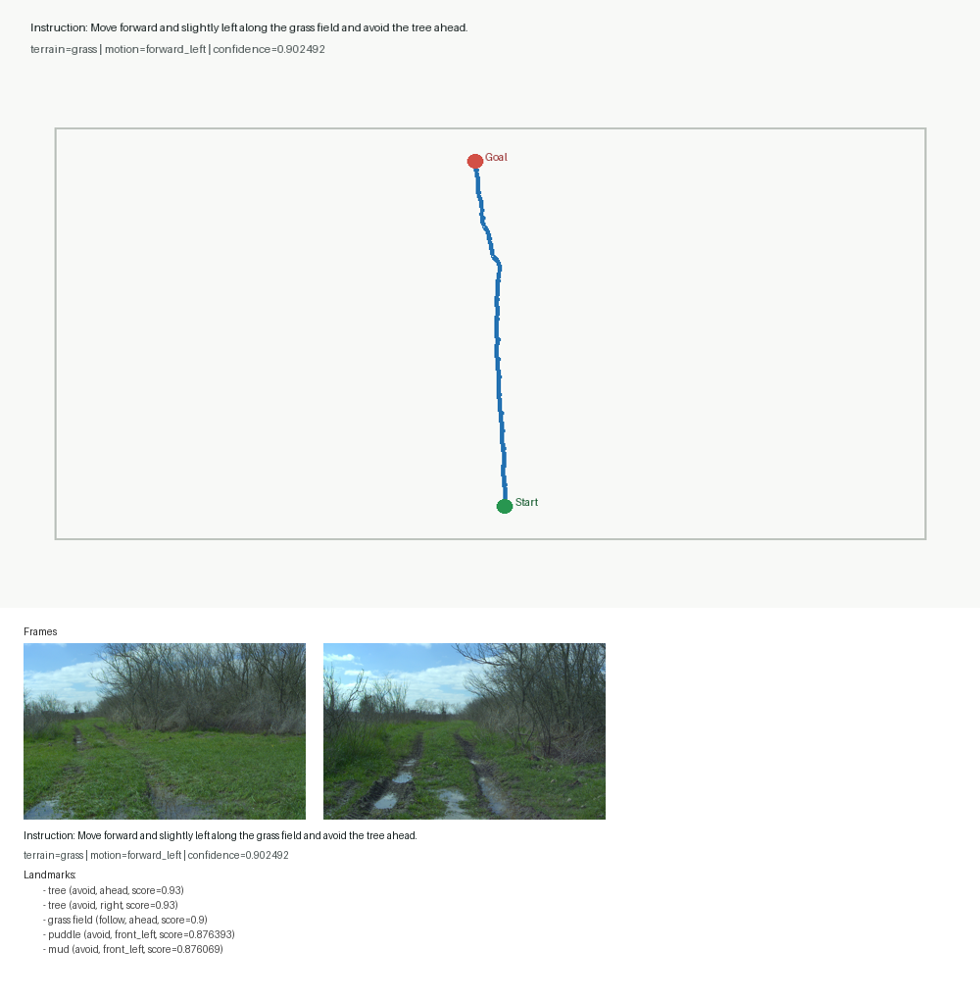
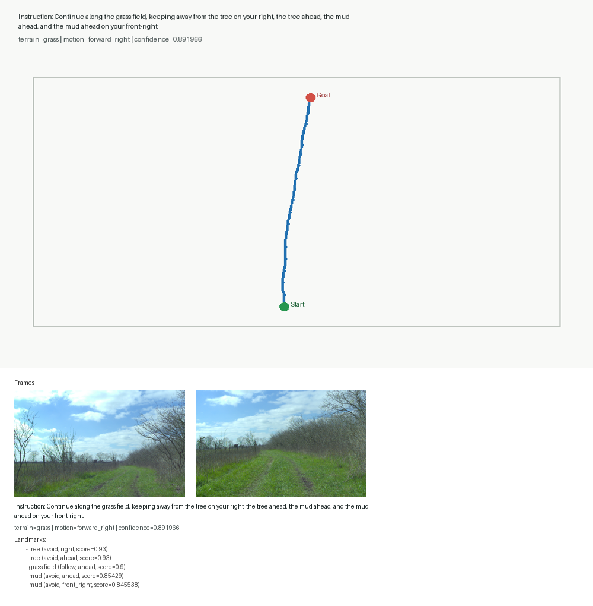

# Outdoor-VLN Pilot Sample Visualizations

## Sample 9

- instruction: Move forward toward the grass field while avoiding the person on your left, the bush ahead, the bush ahead on your front-left, and the bush on your left.
- terrain: grass
- motion: forward
- confidence: 0.884002
- landmarks: person (avoid, left), grass field (follow, ahead), bush (avoid, ahead), bush (avoid, front_left), bush (avoid, left)

## Sample 12

- instruction: Move forward toward the grass field while avoiding the person on your left, the bush ahead, the bush ahead on your front-left, and the bush on your left.
- terrain: grass
- motion: forward
- confidence: 0.884002
- landmarks: person (avoid, left), grass field (follow, ahead), bush (avoid, ahead), bush (avoid, front_left), bush (avoid, left)

## Sample 5

- instruction: Follow the grass field and avoid the person on your left.
- terrain: grass
- motion: forward
- confidence: 0.884002
- landmarks: person (avoid, left), grass field (follow, ahead), bush (avoid, ahead), bush (avoid, front_left), bush (avoid, left)

## Sample 20

- instruction: Move forward and slightly left along the grass field and avoid the tree ahead.
- terrain: grass
- motion: forward_left
- confidence: 0.902492
- landmarks: tree (avoid, ahead), tree (avoid, right), grass field (follow, ahead), puddle (avoid, front_left), mud (avoid, front_left)

## Sample 31

- instruction: Continue along the grass field, keeping away from the tree on your right, the tree ahead, the mud ahead, and the mud ahead on your front-right.
- terrain: grass
- motion: forward_right
- confidence: 0.891966
- landmarks: tree (avoid, right), tree (avoid, ahead), grass field (follow, ahead), mud (avoid, ahead), mud (avoid, front_right)
