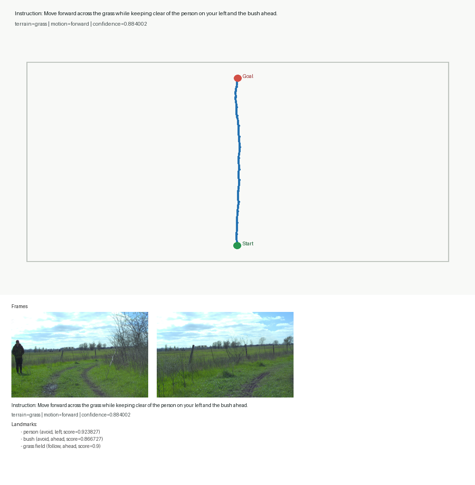
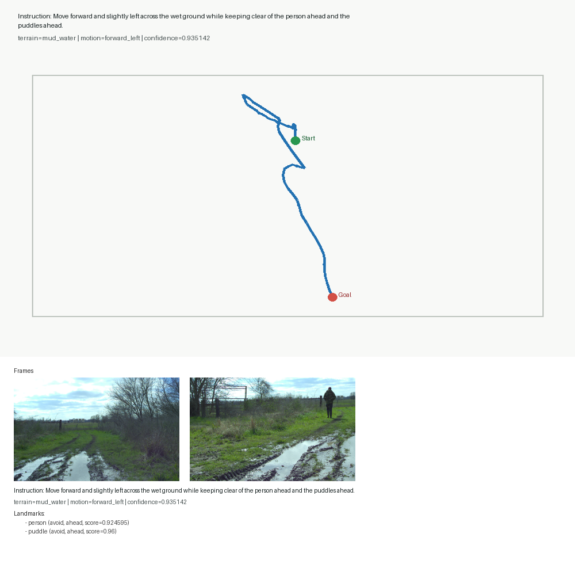
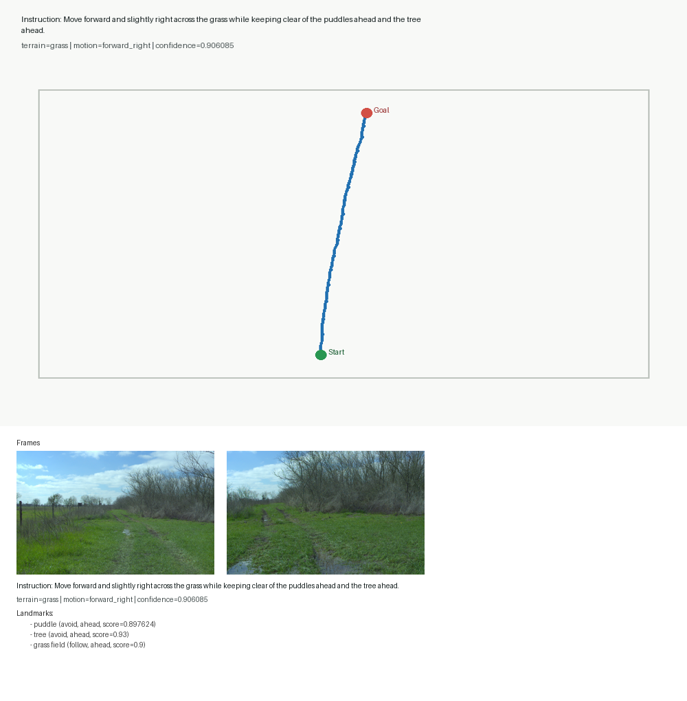
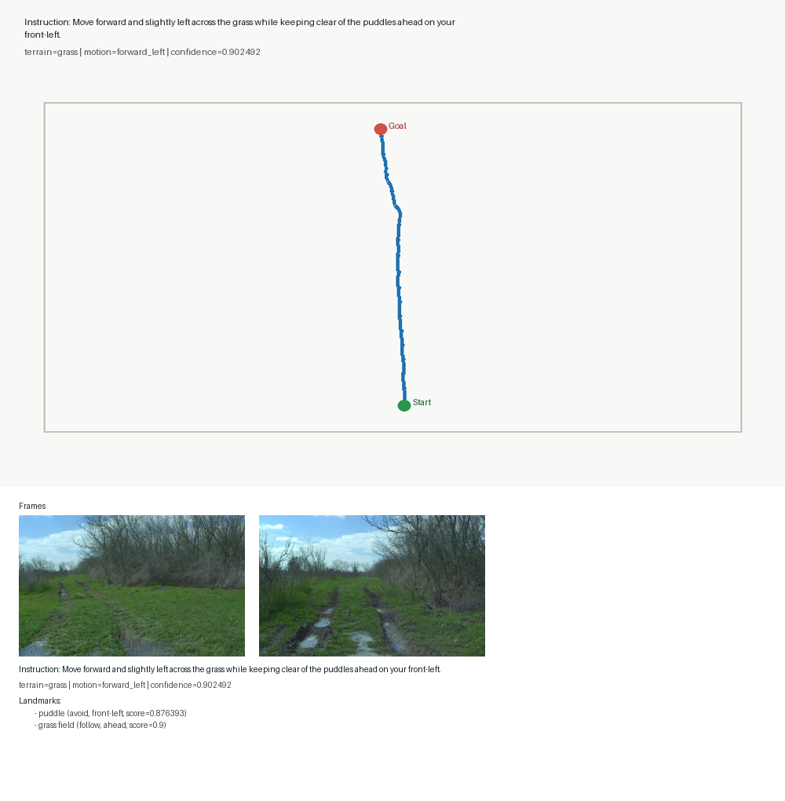
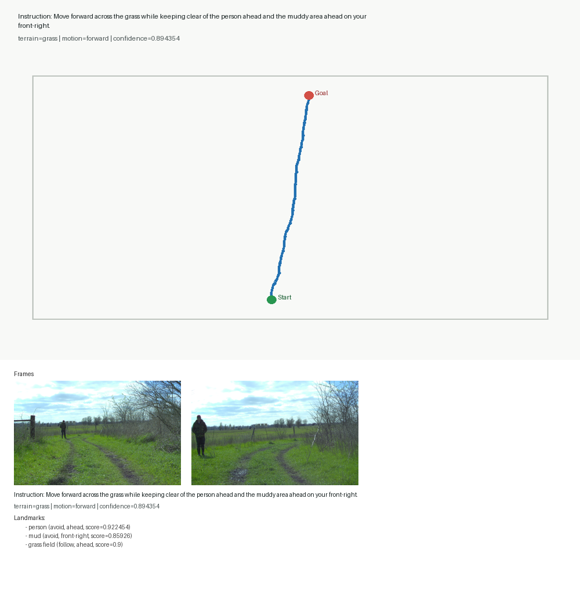
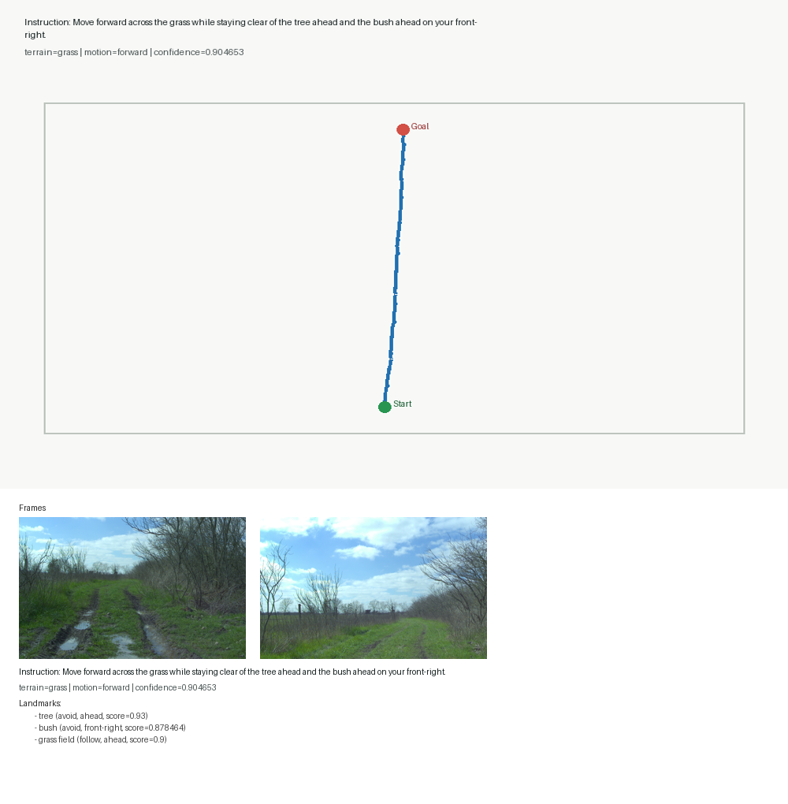
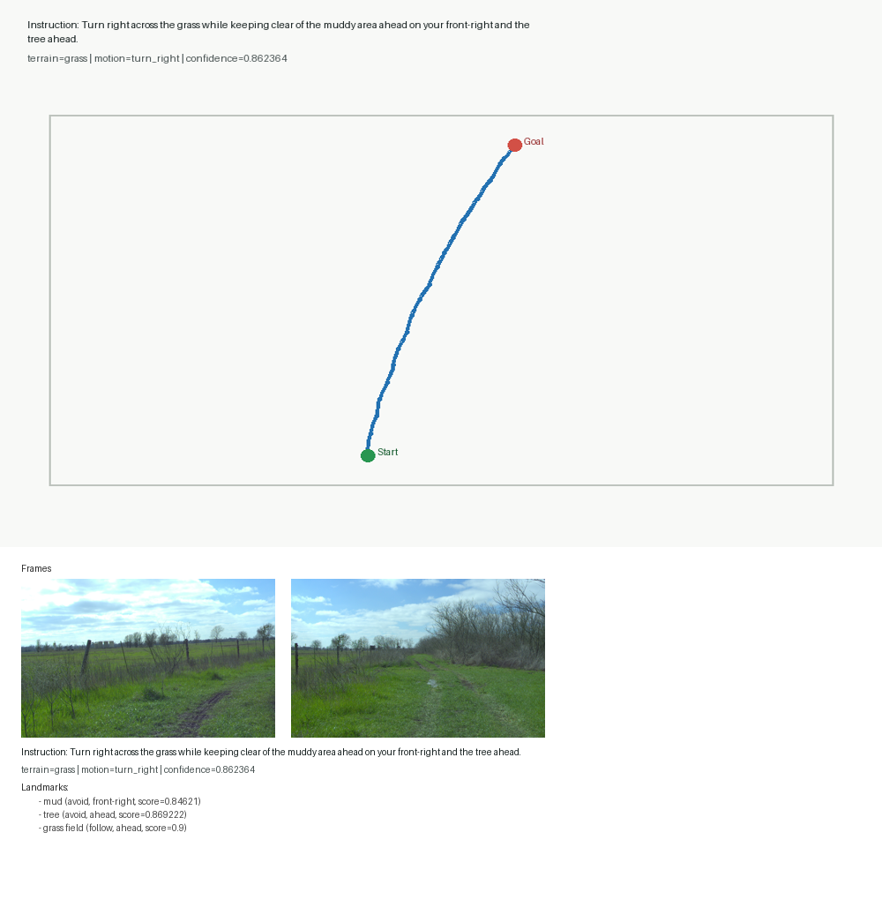

# Outdoor-VLN Manual Audit Sample Visualizations

## Audit 001 | idx 9 | rellis_scene_00000 | seq_00000_000004

- instruction: Move forward across the grass while keeping clear of the person on your left and the bush ahead.
- terrain: grass
- motion: forward
- confidence: 0.884002
- landmarks: person (avoid, left), bush (avoid, ahead), grass field (follow, ahead)

## Audit 002 | idx 12 | rellis_scene_00000 | seq_00000_000004

- instruction: Move forward across the grass while keeping clear of the person on your left and the bush ahead.
- terrain: grass
- motion: forward
- confidence: 0.884002
- landmarks: person (avoid, left), bush (avoid, ahead), grass field (follow, ahead)

## Audit 003 | idx 5 | rellis_scene_00000 | seq_00000_000004

- instruction: Move forward across the grass while staying clear of the person on your left and the bush ahead.
- terrain: grass
- motion: forward
- confidence: 0.884002
- landmarks: person (avoid, left), bush (avoid, ahead), grass field (follow, ahead)

## Audit 004 | idx 20 | rellis_scene_00000 | seq_00000_000007

- instruction: Move forward and slightly left across the grass while staying clear of the puddles ahead on your front-left.
- terrain: grass
- motion: forward_left
- confidence: 0.902492
- landmarks: puddle (avoid, front-left), grass field (follow, ahead)

## Audit 005 | idx 31 | rellis_scene_00000 | seq_00000_000009

- instruction: Move forward and slightly right across the grass while avoiding the muddy area ahead and the tree ahead.
- terrain: grass
- motion: forward_right
- confidence: 0.891966
- landmarks: mud (avoid, ahead), tree (avoid, ahead), grass field (follow, ahead)

## Audit 006 | idx 22 | rellis_scene_00000 | seq_00000_000007

- instruction: Move forward and slightly left across the grass while avoiding the puddles ahead on your front-left.
- terrain: grass
- motion: forward_left
- confidence: 0.902492
- landmarks: puddle (avoid, front-left), grass field (follow, ahead)

## Audit 007 | idx 29 | rellis_scene_00000 | seq_00000_000009

- instruction: Move forward and slightly right across the grass while staying clear of the muddy area ahead and the tree ahead.
- terrain: grass
- motion: forward_right
- confidence: 0.891966
- landmarks: mud (avoid, ahead), tree (avoid, ahead), grass field (follow, ahead)

## Audit 008 | idx 16 | rellis_scene_00000 | seq_00000_000005

- instruction: Turn right across the grass while avoiding the muddy area ahead on your front-right and the tree ahead.
- terrain: grass
- motion: turn_right
- confidence: 0.862364
- landmarks: mud (avoid, front-right), tree (avoid, ahead), grass field (follow, ahead)

## Audit 009 | idx 26 | rellis_scene_00000 | seq_00000_000009

- instruction: Move forward and slightly right across the grass while staying clear of the muddy area ahead and the tree ahead.
- terrain: grass
- motion: forward_right
- confidence: 0.891966
- landmarks: mud (avoid, ahead), tree (avoid, ahead), grass field (follow, ahead)

## Audit 010 | idx 24 | rellis_scene_00000 | seq_00000_000008

- instruction: Move forward across the grass while keeping clear of the tree ahead and the bush ahead on your front-right.
- terrain: grass
- motion: forward
- confidence: 0.904653
- landmarks: tree (avoid, ahead), bush (avoid, front-right), grass field (follow, ahead)

## Audit 011 | idx 14 | rellis_scene_00000 | seq_00000_000005

- instruction: Turn right across the grass while staying clear of the muddy area ahead on your front-right and the tree ahead.
- terrain: grass
- motion: turn_right
- confidence: 0.862364
- landmarks: mud (avoid, front-right), tree (avoid, ahead), grass field (follow, ahead)

## Audit 012 | idx 10 | rellis_scene_00000 | seq_00000_000004

- instruction: Move forward across the grass while avoiding the person on your left and the bush ahead.
- terrain: grass
- motion: forward
- confidence: 0.884002
- landmarks: person (avoid, left), bush (avoid, ahead), grass field (follow, ahead)

## Audit 013 | idx 11 | rellis_scene_00000 | seq_00000_000004

- instruction: Move forward across the grass while staying clear of the person on your left and the bush ahead.
- terrain: grass
- motion: forward
- confidence: 0.884002
- landmarks: person (avoid, left), bush (avoid, ahead), grass field (follow, ahead)

## Audit 014 | idx 27 | rellis_scene_00000 | seq_00000_000009

- instruction: Move forward and slightly right across the grass while keeping clear of the muddy area ahead and the tree ahead.
- terrain: grass
- motion: forward_right
- confidence: 0.891966
- landmarks: mud (avoid, ahead), tree (avoid, ahead), grass field (follow, ahead)

## Audit 015 | idx 8 | rellis_scene_00000 | seq_00000_000004

- instruction: Move forward across the grass while staying clear of the person on your left and the bush ahead.
- terrain: grass
- motion: forward
- confidence: 0.884002
- landmarks: person (avoid, left), bush (avoid, ahead), grass field (follow, ahead)

## Audit 016 | idx 19 | rellis_scene_00000 | seq_00000_000006

- instruction: Move forward and slightly right across the grass while avoiding the puddles ahead and the tree ahead.
- terrain: grass
- motion: forward_right
- confidence: 0.906085
- landmarks: puddle (avoid, ahead), tree (avoid, ahead), grass field (follow, ahead)

## Audit 017 | idx 30 | rellis_scene_00000 | seq_00000_000009

- instruction: Move forward and slightly right across the grass while keeping clear of the muddy area ahead and the tree ahead.
- terrain: grass
- motion: forward_right
- confidence: 0.891966
- landmarks: mud (avoid, ahead), tree (avoid, ahead), grass field (follow, ahead)

## Audit 018 | idx 6 | rellis_scene_00000 | seq_00000_000004

- instruction: Move forward across the grass while keeping clear of the person on your left and the bush ahead.
- terrain: grass
- motion: forward
- confidence: 0.884002
- landmarks: person (avoid, left), bush (avoid, ahead), grass field (follow, ahead)

## Audit 019 | idx 25 | rellis_scene_00000 | seq_00000_000008

- instruction: Move forward across the grass while avoiding the tree ahead and the bush ahead on your front-right.
- terrain: grass
- motion: forward
- confidence: 0.904653
- landmarks: tree (avoid, ahead), bush (avoid, front-right), grass field (follow, ahead)

## Audit 020 | idx 0 | rellis_scene_00000 | seq_00000_000001

- instruction: Move forward and slightly left across the wet ground while keeping clear of the person ahead and the puddles ahead.
- terrain: mud_water
- motion: forward_left
- confidence: 0.935142
- landmarks: person (avoid, ahead), puddle (avoid, ahead)

## Audit 021 | idx 33 | rellis_scene_00000 | seq_00000_000009

- instruction: Move forward and slightly right across the grass while keeping clear of the muddy area ahead and the tree ahead.
- terrain: grass
- motion: forward_right
- confidence: 0.891966
- landmarks: mud (avoid, ahead), tree (avoid, ahead), grass field (follow, ahead)

## Audit 022 | idx 13 | rellis_scene_00000 | seq_00000_000004

- instruction: Move forward across the grass while avoiding the person on your left and the bush ahead.
- terrain: grass
- motion: forward
- confidence: 0.884002
- landmarks: person (avoid, left), bush (avoid, ahead), grass field (follow, ahead)

## Audit 023 | idx 18 | rellis_scene_00000 | seq_00000_000006

- instruction: Move forward and slightly right across the grass while keeping clear of the puddles ahead and the tree ahead.
- terrain: grass
- motion: forward_right
- confidence: 0.906085
- landmarks: puddle (avoid, ahead), tree (avoid, ahead), grass field (follow, ahead)

## Audit 024 | idx 2 | rellis_scene_00000 | seq_00000_000003

- instruction: Move forward across the grass while staying clear of the person ahead and the muddy area ahead on your front-right.
- terrain: grass
- motion: forward
- confidence: 0.894354
- landmarks: person (avoid, ahead), mud (avoid, front-right), grass field (follow, ahead)

## Audit 025 | idx 32 | rellis_scene_00000 | seq_00000_000009

- instruction: Move forward and slightly right across the grass while staying clear of the muddy area ahead and the tree ahead.
- terrain: grass
- motion: forward_right
- confidence: 0.891966
- landmarks: mud (avoid, ahead), tree (avoid, ahead), grass field (follow, ahead)

## Audit 026 | idx 28 | rellis_scene_00000 | seq_00000_000009

- instruction: Move forward and slightly right across the grass while avoiding the muddy area ahead and the tree ahead.
- terrain: grass
- motion: forward_right
- confidence: 0.891966
- landmarks: mud (avoid, ahead), tree (avoid, ahead), grass field (follow, ahead)

## Audit 027 | idx 21 | rellis_scene_00000 | seq_00000_000007

- instruction: Move forward and slightly left across the grass while keeping clear of the puddles ahead on your front-left.
- terrain: grass
- motion: forward_left
- confidence: 0.902492
- landmarks: puddle (avoid, front-left), grass field (follow, ahead)

## Audit 028 | idx 3 | rellis_scene_00000 | seq_00000_000003

- instruction: Move forward across the grass while keeping clear of the person ahead and the muddy area ahead on your front-right.
- terrain: grass
- motion: forward
- confidence: 0.894354
- landmarks: person (avoid, ahead), mud (avoid, front-right), grass field (follow, ahead)

## Audit 029 | idx 23 | rellis_scene_00000 | seq_00000_000008

- instruction: Move forward across the grass while staying clear of the tree ahead and the bush ahead on your front-right.
- terrain: grass
- motion: forward
- confidence: 0.904653
- landmarks: tree (avoid, ahead), bush (avoid, front-right), grass field (follow, ahead)

## Audit 030 | idx 4 | rellis_scene_00000 | seq_00000_000003

- instruction: Move forward across the grass while avoiding the person ahead and the muddy area ahead on your front-right.
- terrain: grass
- motion: forward
- confidence: 0.894354
- landmarks: person (avoid, ahead), mud (avoid, front-right), grass field (follow, ahead)

## Audit 031 | idx 34 | rellis_scene_00000 | seq_00000_000009

- instruction: Move forward and slightly right across the grass while avoiding the muddy area ahead and the tree ahead.
- terrain: grass
- motion: forward_right
- confidence: 0.891966
- landmarks: mud (avoid, ahead), tree (avoid, ahead), grass field (follow, ahead)

## Audit 032 | idx 15 | rellis_scene_00000 | seq_00000_000005

- instruction: Turn right across the grass while keeping clear of the muddy area ahead on your front-right and the tree ahead.
- terrain: grass
- motion: turn_right
- confidence: 0.862364
- landmarks: mud (avoid, front-right), tree (avoid, ahead), grass field (follow, ahead)

## Audit 033 | idx 17 | rellis_scene_00000 | seq_00000_000006

- instruction: Move forward and slightly right across the grass while staying clear of the puddles ahead and the tree ahead.
- terrain: grass
- motion: forward_right
- confidence: 0.906085
- landmarks: puddle (avoid, ahead), tree (avoid, ahead), grass field (follow, ahead)

## Audit 034 | idx 1 | rellis_scene_00000 | seq_00000_000001

- instruction: Move forward and slightly left across the wet ground while avoiding the person ahead and the puddles ahead.
- terrain: mud_water
- motion: forward_left
- confidence: 0.935142
- landmarks: person (avoid, ahead), puddle (avoid, ahead)

## Audit 035 | idx 7 | rellis_scene_00000 | seq_00000_000004

- instruction: Move forward across the grass while avoiding the person on your left and the bush ahead.
- terrain: grass
- motion: forward
- confidence: 0.884002
- landmarks: person (avoid, left), bush (avoid, ahead), grass field (follow, ahead)
